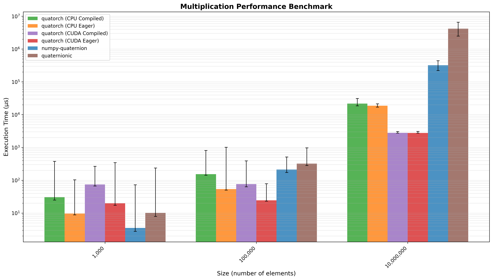
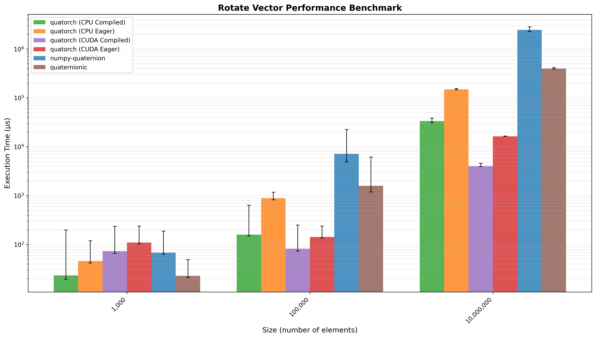
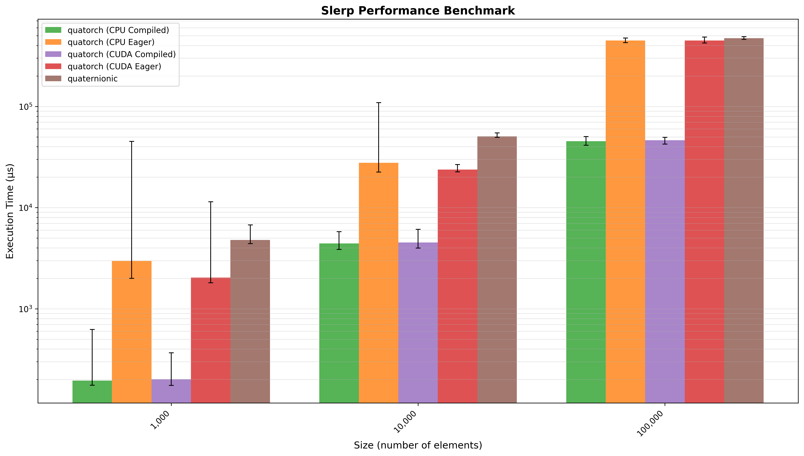

# Performance Benchmarks

This page presents performance benchmarks comparing QuaTorch against other quaternion libraries across different computational backends.

## System Information

The benchmarks were performed on the following system:

- **CPU**: 13th Gen Intel(R) Core(TM) i7-13700H (20 cores)
- **RAM**: 16 GB
- **GPU**: NVIDIA GeForce RTX 4050 Laptop GPU (6141 MiB)
- **System**: Linux 6.14.0-37-generic
- **Python**: 3.13.3 (CPython)

## Benchmark Methodology

The benchmarks compare the following implementations:

- **numpy-quaternion**: Using the [`numpy-quaternion`](https://quaternion.readthedocs.io/en/latest/) package
- **quaternionic**: Using the [`quaternionic`](https://quaternionic.readthedocs.io/en/latest/) library
- **cpu_eager**: QuaTorch on CPU in eager mode
- **cpu_compiled**: QuaTorch on CPU with `torch.compile`
- **cuda_eager**: QuaTorch on CUDA in eager mode
- **cuda_compiled**: QuaTorch on CUDA with `torch.compile`

Each benchmark measures execution time across different input sizes to evaluate scaling behavior. The bars represent mean execution time, with whiskers showing the range between minimum and maximum measured times.


```{admonition} ⚠️ **Note on Fair Comparisons**
These benchmarks should be interpreted with caution for several reasons:

1. **Different Compute Devices**: CPU-based methods (numpy, quaternionic, cpu_eager, cpu_compiled) run on the Intel i7-13700H processor, while CUDA methods run on the NVIDIA RTX 4050 GPU. These are fundamentally different architectures optimized for different workloads.

2. **Compilation Benefits**: The `torch.compile` results show the benefits of PyTorch's JIT compilation, but this benefit is only realized after a warmup period. First-run performance may differ.

3. **Dependencies**: The `numpy-quaternion` library has no dependencies. `quaternionic` depends on `numba` for JIT compilation. QuaTorch's performance depends on PyTorch's optimizations and GPU acceleration.

```

## Reproducing the Benchmarks

To reproduce these benchmarks on your own system:

### 1. Run the Benchmark Tests

```bash
# Run all benchmarks and save results to benchmark_output.json
uv run pytest test/benchmark/test_performance.py --benchmark-only
```

The benchmark results will be saved to `benchmark_output.json` in the project root.

### 2. Generate Plots

After running the benchmarks, generate the visualization plots:

```bash
# Run the plotting test
uv run python  test/benchmark/test_performance.py benchmark_output.json
```

The plots will be saved as PNG files in the project root directory.

## Benchmark Results

### Quaternion Multiplication

Multiplication of two vectors of `n` quaternions. Quatorch (CPU Compiled) performed 1.33x faster than `numpy-quaternion` and 5.11x faster than `quaternionic` (geometric mean across all input sizes).



### Vector Rotation

Rotation of a 3D vector by a vector of `n` quaternions. Quatorch (CUDA Compiled) performed 21.32x faster than `numpy-quaternion` and 4.89x faster than `quaternionic` (geometric mean across all input sizes).




### Spherical Linear Interpolation (SLERP)

SLERP interpolation between two vectors of `n` quaternions. Quatorch (CUDA Compiled) performed 14.32x faster than `quaternionic` (geometric mean across all input sizes).


